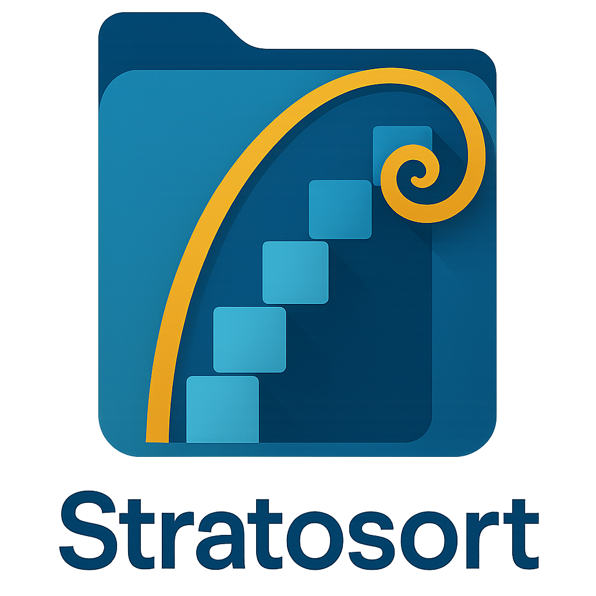

# 🎯 StratoSort - AI-Powered Document Organization

<div align="center">
  
  
  [](https://opensource.org/licenses/MIT)
  [](https://www.electronjs.org/)
  [](https://reactjs.org/)
  [](https://ollama.ai/)
  [](https://tailwindcss.com/)
</div>

> **Built upon the foundation of [LlamaFS](https://github.com/iyaja/llama-fs)** - A revolutionary file organization system that inspired StratoSort's core vision.

---

## 📋 Table of Contents

- [Overview](#overview)
- [What is Ollama?](#what-is-ollama)
- [How StratoSort Differs from LlamaFS](#how-stratosort-differs-from-llamafs)
- [Features](#features)
- [Complete Walkthrough](#complete-walkthrough)
- [Installation & Setup](#installation--setup)
- [Architecture](#architecture)
- [Development](#development)
- [Testing](#testing)
- [Contributing](#contributing)
- [Acknowledgments](#acknowledgments)
- [License](#license)

---

## 🚀 Overview

**StratoSort** is a privacy-focused, AI-powered document organization tool that runs entirely on your local machine. Inspired by [LlamaFS](https://github.com/iyaja/llama-fs), StratoSort takes the concept of AI-driven file organization to the next level with a modern desktop application, advanced UI/UX, and enterprise-grade features.

Using **Ollama** for local AI processing, StratoSort intelligently categorizes and organizes your documents without sending any data to external servers, ensuring complete privacy and control over your files.

### 🔑 Key Benefits

- **🔒 100% Privacy**: All AI processing happens locally on your machine
- **🤖 Smart Organization**: Advanced AI content analysis and categorization
- **🎨 Modern Interface**: Beautiful, accessible desktop app with Apple-inspired design
- **⚡ Batch Processing**: Handle thousands of files simultaneously

---

## ✨ Features

### Core Functionality
- **Smart Document Analysis**: AI-powered content understanding
- **Automatic Organization**: Intelligent folder creation and file placement
- **Batch Processing**: Handle multiple documents simultaneously
- **Custom Naming Conventions**: Flexible file naming patterns
- **Multi-format Support**: PDF, images, text documents, and more

## 🏗️ Architecture

```
stratosort/
├── electron-react-app/     # Main Electron application
│   ├── src/
│   │   ├── main/          # Main process (backend)
│   │   │   ├── services/  # Core services
│   │   │   ├── utils/     # Utility functions
│   │   │   └── workers/   # Background workers
│   │   ├── renderer/      # Renderer process (frontend)
│   │   │   ├── components/# React components
│   │   │   └── styles/    # CSS and styling
│   │   └── preload/       # Preload scripts
│   ├── assets/            # Icons and resources
│   └── config/            # Configuration files
├── tests/                 # Test suites
├── scripts/               # Build and setup scripts
└── docs/                  # Documentation
```

## 🚀 Getting Started

### Prerequisites

- **Node.js** 14.0.0 or higher
- **npm** 6.0.0 or higher
- **Ollama** (required for AI features)

### Installation

1. **Clone the repository**
   ```bash
   git clone https://github.com/stratosort/stratosort.git
   cd stratosort
   ```

2. **Install dependencies**
   ```bash
   npm run setup
   ```

3. **Install Ollama and Gemma model**
   ```bash
   # Download and install Ollama from https://ollama.ai
   # Or using package managers:
   
   # Windows (using winget)
   winget install Ollama.Ollama
   
   # macOS (using Homebrew)
   brew install ollama
   
   # Linux
   curl -fsSL https://ollama.ai/install.sh | sh
   ```

4. **Start Ollama service**
   ```bash
   ollama serve
   ```

5. **Install Gemma model**
   ```bash
   # Install Gemma 2B model (recommended for most systems)
   ollama pull gemma:2b
   
   # Or install Gemma 7B model (requires more RAM)
   ollama pull gemma:7b
   ```

6. **Verify installation**
   ```bash
   # Check if Ollama is running
   ollama list
   
   # Test Gemma model
   ollama run gemma:2b "Hello, how are you?"
   ```

7. **Start the application**
   ```bash
   npm start
   ```

## 💻 Development

### Available Scripts

```bash
# Development
npm run dev          # Start in development mode
npm run lint         # Run ESLint
npm run format       # Format code with Prettier

# Building
npm run build        # Build for production
npm run package      # Create distributable

# Testing
npm test             # Run all tests
npm run test:unit    # Unit tests only
npm run test:integration # Integration tests

# Utilities
npm run clean        # Clean build artifacts
npm run setup:ollama # Setup Ollama and models
```

### Project Structure

- **Main Process**: Handles file operations, AI processing, and system integration
- **Renderer Process**: React-based UI with modern component architecture
- **Services**: Modular services for different functionalities
  - `AnalysisHistoryService`: Document tracking and search
  - `UndoRedoService`: Action history management
  - `AccessibilityService`: Accessibility features
  - `ServiceIntegration`: Unified service interface

## 🧪 Testing

The project includes comprehensive test coverage:

- **Unit Tests**: Component and service testing
- **Integration Tests**: End-to-end workflow testing
- **Performance Tests**: Memory and processing benchmarks

Run tests with:
```bash
npm test              # All tests
npm run test:unit     # Unit tests only
npm run test:integration # Integration tests
```

## 🤝 Contributing

We welcome contributions! Please see our [Contributing Guide](docs/CONTRIBUTING.md) for details.

### Development Workflow

1. Fork the repository
2. Create a feature branch (`git checkout -b feature/amazing-feature`)
3. Commit your changes (`git commit -m 'Add amazing feature'`)
4. Push to the branch (`git push origin feature/amazing-feature`)
5. Open a Pull Request

## 📄 License

This project is licensed under the **MIT License** - see the [LICENSE](LICENSE) file for details.

### **What this means:**
- ✅ **Commercial Use** - Use StratoSort in commercial projects
- ✅ **Modification** - Modify and customize the code
- ✅ **Distribution** - Share and redistribute freely
- ✅ **Private Use** - Use for personal projects
- ❗ **No Warranty** - Software provided as-is
- ❗ **Attribution** - Include copyright notice in distributions

---

<div align="center">

**Made with ❤️ by the StratoSort Team**

*Inspired by [LlamaFS](https://github.com/iyaja/llama-fs) • Powered by [Ollama](https://ollama.ai) • Built with [Electron](https://electronjs.org)*

**Standing on the shoulders of giants, reaching for the stars** 🌟

</div>
