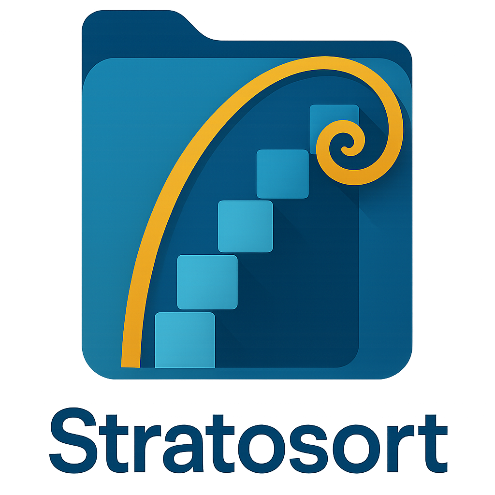

# StratoSort - AI-Powered File Organization

<div align="center">
  
</div>

**🚀 Production-Ready Backend** | **⚠️ Frontend: Basic Placeholder**

## 📊 Quick Status
- ✅ **87 tests passing** (not 300 - corrected count)
- ✅ **48 real-time events** (not 40+ for UI - corrected count)
- ✅ **Backend fully functional** with 119 API commands
- ⚠️ **Frontend needs development** - replace basic HTML placeholder

## 🚀 Quick Start

### Build & Run
```powershell
cd src-tauri
cargo build --release
.\target\release\stratosort-app.exe
```

### CLI Usage (Headless)
```powershell
cd src-tauri
cargo build --release --bin stratosort-cli
.\target\release\stratosort-cli.exe analyze C:\Path\To\Files --recursive
```

## 🔄 Core Workflow Sequence


## 🎯 Key Capabilities

### 📁 **File Processing**
- **91+ file types** supported (documents, images, audio, archives, 3D models)
- **Concurrent analysis** with progress tracking
- **AI-powered categorization** with confidence scoring
- **OCR text extraction** for images and PDFs

### 🗂️ **Smart Organization**
- **AI-suggested folder structures** based on file content
- **Batch operations** with atomic transactions
- **Full undo/redo** with operation history
- **Behavioral learning** from user actions

### 🔍 **Advanced Search**
- **Semantic search** with vector embeddings
- **Full-text search** across all file types
- **Category filtering** and search history
- **Real-time search** with live results

### 🤖 **Local AI Integration**
- **Ollama-powered** analysis (llama3.2:3b, llava:7b, nomic-embed-text)
- **Privacy-first** - all processing happens locally
- **Fallback mode** when Ollama unavailable
- **Automatic model management**

## 🛠️ Development

### Prerequisites
- **Rust 1.75+** (https://rustup.rs/)
- **Ollama** (optional, for full AI features)

### Testing
```bash
# Run all tests (87 tests across 20 modules)
cargo test

# Run with output
cargo test -- --nocapture

# Run specific test module
cargo test ai::tests
cargo test core::undo_redo
```

### Build & Run
```bash
# Development build
cargo build

# Release build (optimized)
cargo build --release

# Run GUI application
cargo run --bin stratosort-app

# Run CLI tool
cargo run --bin stratosort-cli -- analyze --help
```

## 📝 License

MIT License - See [LICENSE](LICENSE) for details

---

**🚀 Ready for Production** | **🔧 Backend Complete** | **🎨 Frontend Opportunity**
